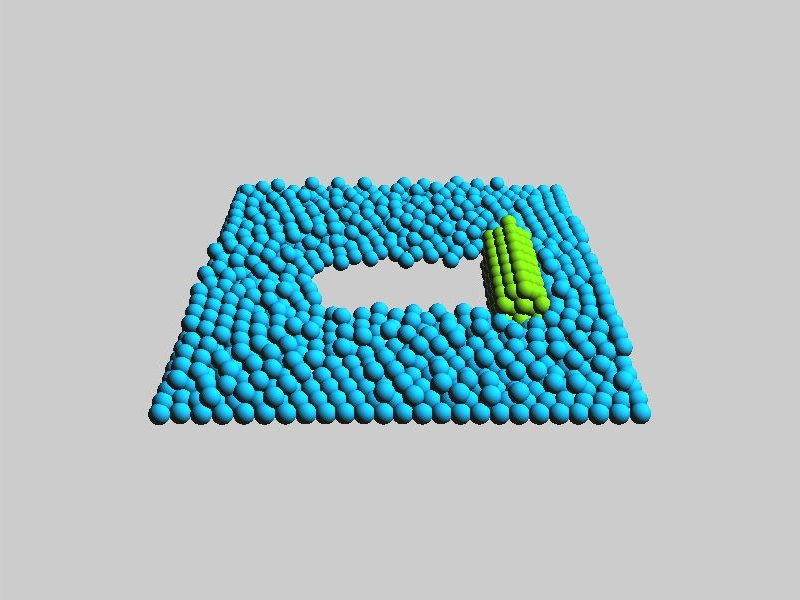
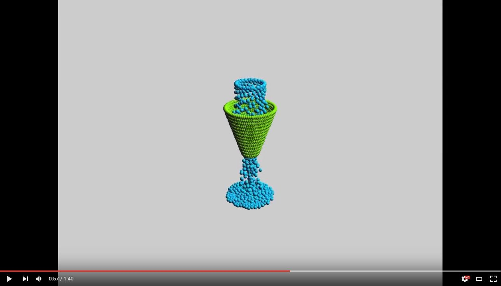
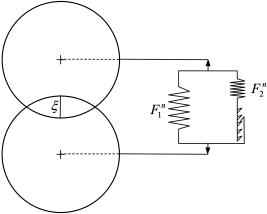
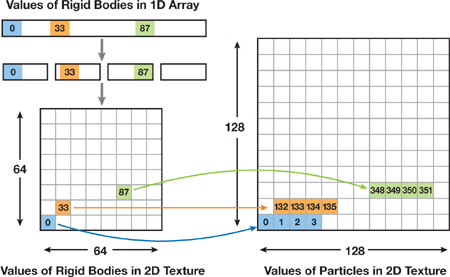
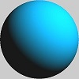
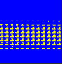
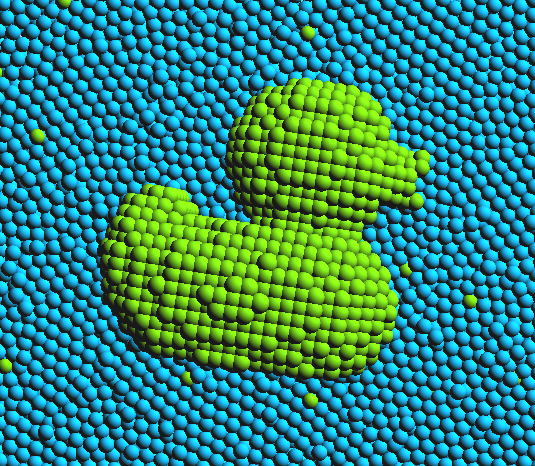
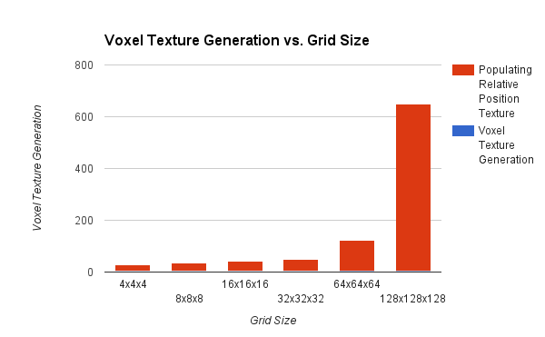
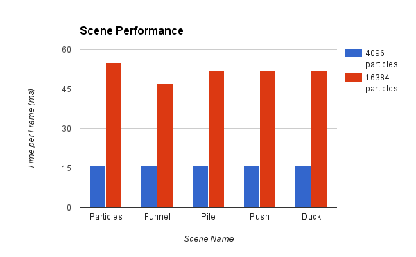

WebGL Unified Particle System
======================

**Richard Lee and Ottavio Hartman**

A unified particle and rigid body simulation in WebGL, inspired by [this GPU Gems article](http://http.developer.nvidia.com/GPUGems3/gpugems3_ch29.html). 

 
Try the live demo [here](https://leerichard42.github.io/WebGL-Unified-Particle-System/). 
This project requires a WebGL capable browser which supports the extensions `OES_texture_float`,
`OES_texture_float_linear`, `WEBGL_depth_texture`, `WEBGL_draw_buffers`, and `EXT_frag_depth`.
>**Controls** 
>`click + drag` : Rotate camera view 
>`right click + drag` : Pan camera view 
>`mouse scroll` : Zoom camera

## Features

### Discrete Element Method
In this simulation, collisions are resolved through the discrete element method (DEM), which models particle collisions as a system of springs and dampers. Each particle has a mass and various collision coefficients which can be used to tune each simulation scene.

In addition, 2D textures were used to store the positions, velocities, and acting forces of each particle - these textures were ping-ponged on each frame to update the simulation using the second order Runge-Kutta method.

From left to right, the textures in the clip represent the positions, velocities, forces, and the uniform grid (discussed below).

### Uniform Grid
In order to increase the performance of the shaders, a uniform grid was created so each particle could search its nearest neighbors when doing physics calculations. The procedure for generating and updating the uniform grid was adapted from [GPU gems](http://http.developer.nvidia.com/GPUGems3/gpugems3_ch29.html).

A 3D texture represents the voxels in the uniform grid, and each pixel stores the index of the particles contained within it. Since WebGL 1 does not support 3D textures, we adapted a mapping from a 3D texture coordinate onto a 2D texture. The 2D texture can be seen below:

The uniform grid is divided into cells of width the same as the diameter of the particles. The reasoning behind this is that it minimized the number of neighboring cells that must be searched in the physics calculations while minimizing the number of particles in a cell. Ideally, each grid cell could hold only one particle, but in practice this is not the case--particles can "squeeze" into a cell depennding on the conditions. In order to handle this edge case, we use a process for updating the grid which fits up to four particle indices in each grid cell. This scattering operation requires a vertex shader to be run in 4 passes, each pass filling in a different component of the grid texture (R, G, B, A) with a particle index. Each pass exploits the fact that the particles are render in ascending index order, with increasing depths. By manipulating the stencil and depth buffers, we successfully populate the 3D grid texture with up to four particles per cell. This process is shown below:

(Image credit: [NVIDIA Gpu Gems](http://http.developer.nvidia.com/GPUGems3/gpugems3_ch29.html))

##### Pitfalls
The uniform grid performs very well under the right conditions (see the Performance Analysis section). However, the uniform grid breaks down in other conditions. If we were to implement particles of different sizes, for example, we'd have to make the uniform grid's cell size equal to the diameter of the smallest particle. In cases where the particle sizes vary greatly, this will mean each particle has to search a large number of neighboring cells, decreasing the performance benefit of the uniform grid.

Another case we ran into where the uniform grid began failing was when too many heavy particles were stacked on top of each other. In this scenario, the pressure of the particles managed to squeeze more than 4 particles into some cells. This made the sea of particles "pop" as particles confused themselves with other particles because of the id lookup in the grid cell.

Finally, since textures have a maximum limit of 4096x4096 on most computers with WebGL, the grid size is limited to around 255 cells per side (256*256*256 = 4096*4096). This means that as the size of the particles decrease (which increases the number of cells per side on the grid), the uniform grid becomes inviable at a certain point.

### Rigid Bodies
Rigid bodies were simulated as a set of particles which were fixed relative to a specific body. The state for a single rigid body is comprised of its center of mass, rotation, linear momentum, and angular momentum. On each frame, the position and velocity for each particle was calculated based on the state of its rigid body and its position relative to the body, before the interparticle forces were calculated as normal. The particle forces for a body were then summed in order to produce a total force and torque, which were used to update the body state.

The rigid body states were stored in their own 2D textures, which interfaced with the particle data through indices stored in the alpha channel of the various state structures.

### Particle Rendering
The particle spheres were rendered in screen space using GL_POINTS, by calculating the point size based on the depth of the point and determining the eye-space sphere normal from the point coordinates.

### Arbitrary Model Loading
Defining rigid bodies by hand is quite tedious. We implemented a method of generating rigid body definitions through a process called [depth peeling](https://en.wikipedia.org/wiki/Depth_peeling). Essentially, we bound any volume (in this case, a duck), with a uniform voxel grid. We render an orthographic, axis-aligned projection of the object into a texture, and then, keeping the depth texture untouched, we render the object again with `gl.DepthFunc` set to `gl.GREATER`. Now we have two images: one representing the first point of contact of a "ray" coming from the camera, one representing the second point of contact of that ray:

(Image credit: [NVIDIA Gpu Gems](http://http.developer.nvidia.com/GPUGems3/gpugems3_ch29.html))

Next, we run a fragment shader which calculates a unique voxel position for its `uv` coordinate. This is similar to the 3D grid since it is a 2D representation of a 3D cube. The fragment shader then calculates if the 3D position of the voxel is in between the two depth peel images--if it is, it writes a `1` to a texture. Unlike the scattering operation of the uniform grid, we can run this as a gather operation on every voxel grid coordinate. This texture looks something like this for the duck:

Finally, the values in this texture are converted to relative positions and fed into the rigid body shaders. This process allows us to define different resolutions of meshes--a high resolution screenshot of the duck is shown below.

## Performance Analysis

- Tested on:
 * Firefox 49.0.2, Windows 10, i5-3570K @ 3.40GHz 16GB, Radeon HD 7900
 * Google Chrome 54.0.2840.71, Windows 10, FX-8320 @ 3.50GHz 8GB, GTX 1060 3GB

#### Particle Mesh Generation
The overhead of generating the particle mesh for the duck comes only at the beginning of loading the program. Since its values are stored in a texture, it could even be loaded from a server in order to save the computer some extra computation. The actual time it takes to render the two depth peel images is very small, hovering around 3-4ms as the grid size increased. What takes the most time in our implementation is actually a javascript function which calls `gl.readPixels` on the texture in order to buffer them into another texture. This operation could be done by a fragment shader, and, had time permitted, would have been done so. However, since the performance hit for even a large 128x128x128 grid is under 1 second, the extra performance savings might not warrant the inclusion of another shader. The data can be seen below:

Notice how the blue area in the stacked bars is barely visible; the depth images render very quickly.

### Naive vs. Grid Collision Detection

 
The runtime of the simulation was largely a function of how many interparticle collisions had to be calculated on each timestep. As a result, the uniform grid provided a significant advantage in the number of particles that could be simulated at once. While the naive method had a running time of O(n^2), as it checked each particle with every other particle, the grid method was O(n), since it only needed to check the 27 cells surrounding a particle's grid index.

### Performance among scenes
 
The different scenes had roughly the same performance. The scene with just particles took slightly longer, possibly because it consisted entirely of particles and had more interparticle collisions to account for, while the funnel scene was slightly faster due to the fact that a large portion of the particles in the scene comprised the static funnel.

### References

* [GPU Gems 3 Chapter 29](http://http.developer.nvidia.com/GPUGems3/gpugems3_ch29.html)
* [Rendering to Texture](http://learningwebgl.com/blog/?p=1786)
* [Screen-Space Sphere Rendering](http://developer.download.nvidia.com/presentations/2010/gdc/Direct3D_Effects.pdf)
* [Three.js](https://github.com/mrdoob/three.js) by [@mrdoob](https://github.com/mrdoob) and contributors
* [stats.js](https://github.com/mrdoob/stats.js) by [@mrdoob](https://github.com/mrdoob) and contributors
* [webgl-debug](https://github.com/KhronosGroup/WebGLDeveloperTools) by Khronos Group Inc.
* [glMatrix](https://github.com/toji/gl-matrix) by [@toji](https://github.com/toji) and contributors
* [minimal-gltf-loader](https://github.com/shrekshao/minimal-gltf-loader) by [@shrekshao](https://github.com/shrekshao)
